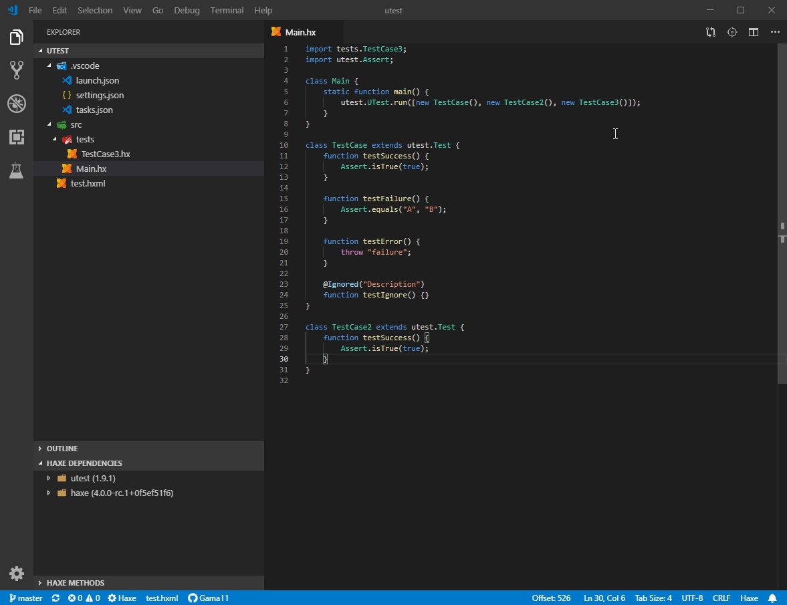

# Haxe Test Explorer for Visual Studio Code

[](https://github.com/vshaxe/haxe-test-adapter/actions?query=workflow%3ACI) [](https://marketplace.visualstudio.com/items?itemName=vshaxe.haxe-test-adapter) [](https://marketplace.visualstudio.com/items?itemName=vshaxe.haxe-test-adapter)

A test adapter for VSCode using the [Test Explorer UI](https://marketplace.visualstudio.com/items?itemName=hbenl.vscode-test-explorer) extension.



## Features

* Records [munit](https://github.com/massiveinteractive/MassiveUnit), [utest](https://github.com/haxe-utest/utest), [buddy](https://github.com/ciscoheat/buddy), [hexUnit](https://github.com/DoclerLabs/hexUnit), [tink_unittest](https://github.com/haxetink/tink_unittest) and [haxe.unit](https://api.haxe.org/haxe/unit/TestRunner.html) test results as JSON files
* Shows latest test results in VSCode using the Test Explorer UI extension
* Supports filtering / running individual tests directly from VSCode
* Supports Haxe 3.4.7 and 4+ (detection of test function line numbers only works with Haxe 4)
* Currently only works for Node.js and sys targets

## Usage

A small sample project for each supported framework can be found in the [samples](https://github.com/vshaxe/haxe-test-adapter/tree/master/samples) directory.

You can run your tests using the `Test Explorer: Run all tests` command or by clicking the button in the "Test" tab of the activity bar. The command that it runs can be configured with this setting:

```json
"haxeTestExplorer.testCommand": [
	"${haxe}",
	"test.hxml",
	"-lib",
	"test-adapter"
]
```

As you can see, by default it assumes the presence of a `test.hxml` that compiles and runs the tests. Additionally, the `test-adapter` library is injected. It adds hooks to the different testing frameworks to record the test results in a `.unittest` folder in your workspace.

While the `test-adapter` library itself ships with the extension and is set up automatically, you still need to install a dependency:

```hxml
haxelib install json2object
```

`.unittest` should be added to your `.gitignore`. You might also want to hide it from VSCode's file explorer by adding this to your global settings:

```json
"files.exclude": {
	"**/.unittest": true
}
```

### Debugging

It's also possible to debug tests using a launch configuration from `launch.json`. Which one should be used can be configured with this setting:

```json
"haxeTestExplorer.launchConfiguration": "Debug"
```

Unlike with `testCommand` for _running_ tests, `-lib test-adapter` can't be injected automatically for _debugging_. Add `-lib test-adapter` directly to your HXML file if you want results to be recorded / filtering to work while debugging.

### Detection of test positions

Note that for `munit`, `hexUnit` and `tink_unittest`, the test-adapter library relies on a class name filter to detect the positions of tests. This simply defaults to `~/Test/` and is checked against the names of classes and implemented interfaces anywhere in the hierarchy of a class.

You can customize the filter with `-D test-adapter-filter=<filter>`. Check `.unittest/positions.json` to see what positions were recorded.

For `utest`, test detection only works when `utest.ITest` is implemented / `utest.TestCase` is extended. If this is not the case, utest will print a warning.

## Build from sources

```bash
cd ~/.vscode/extensions
git clone https://github.com/vshaxe/haxe-test-adapter
cd haxe-test-adapter
npm install
npx haxe build.hxml

haxelib dev test-adapter test-adapter
```

It's also necessary to have the [Test Explorer UI](https://marketplace.visualstudio.com/items?itemName=hbenl.vscode-test-explorer) extension installed (when installing Haxe Test Explorer from the markteplace, this is done automatically).

If you open the project in VSCode, the default `display.hxml` assumes you have all supported test frameworks installed. If you just want code completion for the sources of the extension itself, or the non-framework-specific parts of `test-adapter`, you can select `build.hxml` as your active Haxe configuration instead.
